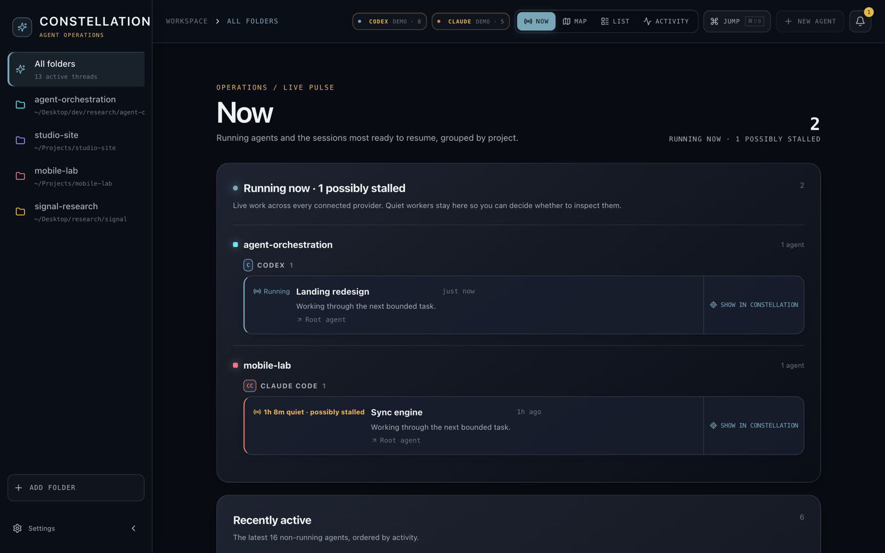
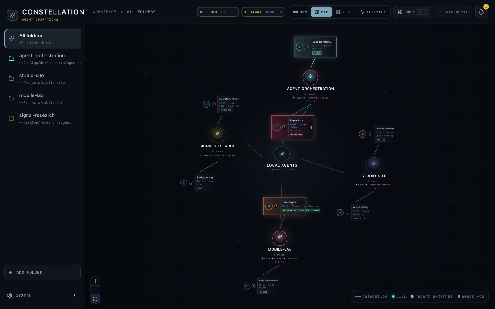
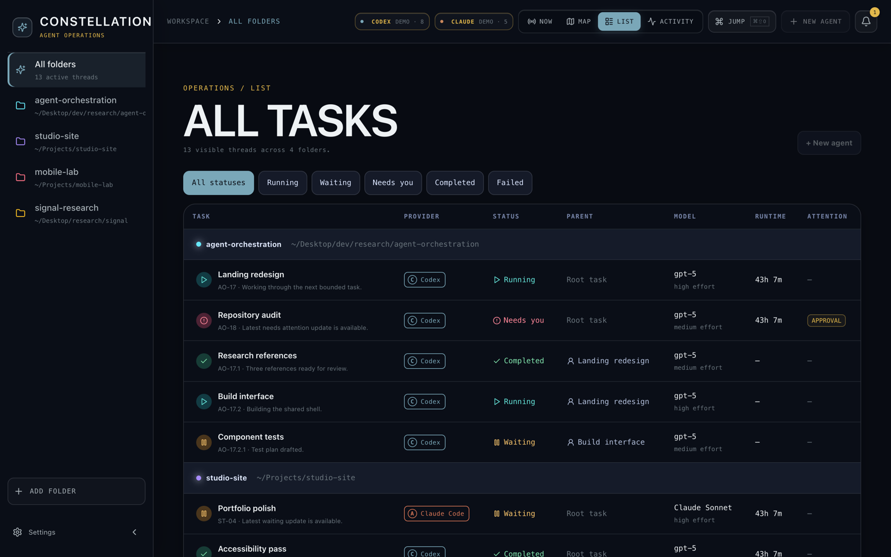
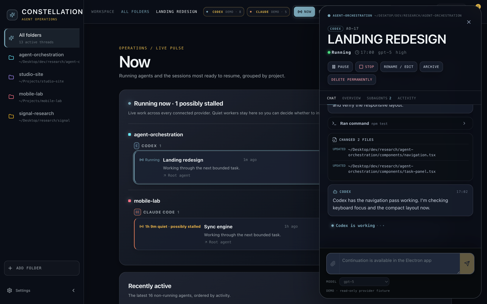
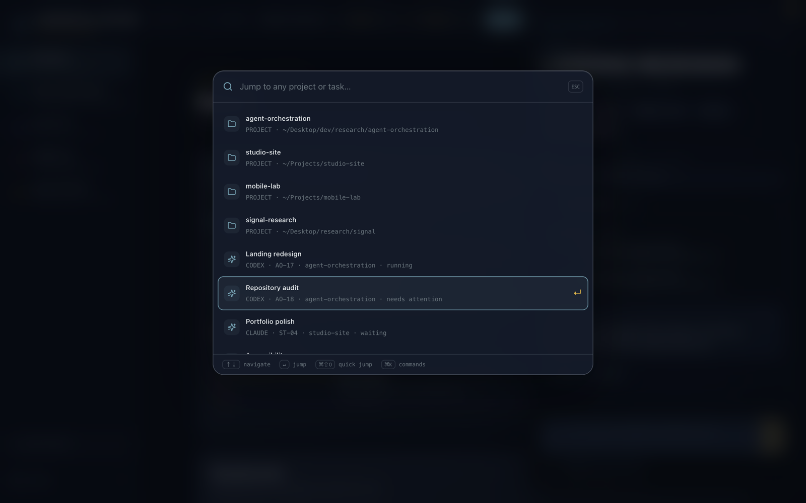
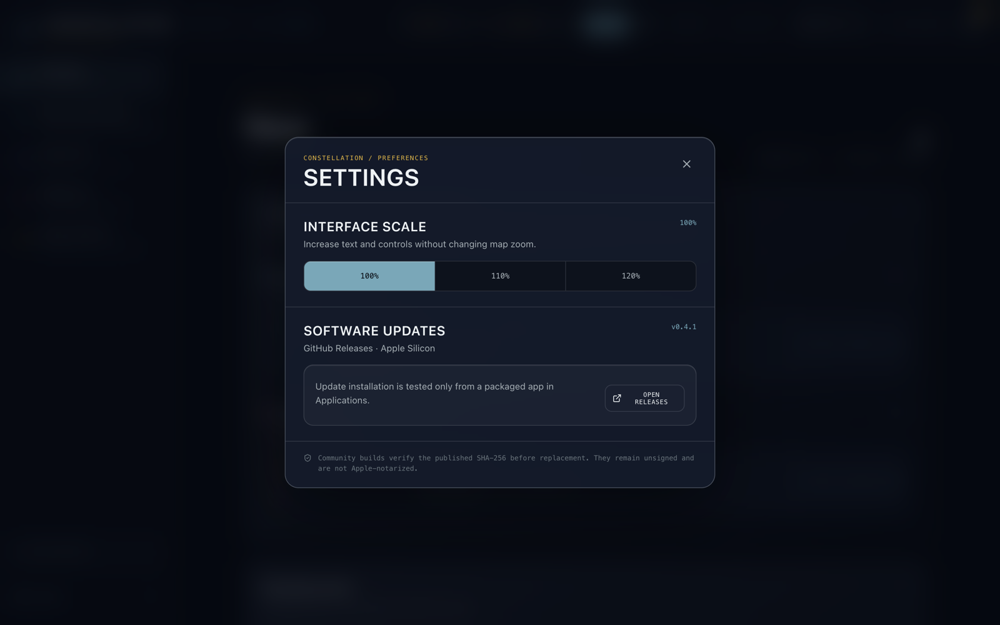

# Yet Another Agent Orchestrator

**Constellation** is a local-first Electron command center for real Codex and Claude Code projects, tasks, chats, and subagents. It combines a cinematic spatial map with practical list, activity, search, task, transcript, changed-file, image-preview, and Reveal-in-Finder workflows.

No local web server is needed after installation.



## Constellation v0.4.0 guided tour

[](docs/media/constellation-v0.4.0-tour.mp4)

[Watch the Constellation v0.4.0 guided tour](docs/media/constellation-v0.4.0-tour.mp4) — a silent, text-led walkthrough using synthetic demo data only.

<details>
<summary>More screenshots — synthetic demo data only</summary>











</details>

> All repository screenshots use the synthetic fixtures in `lib/data/mockData.ts`. They contain no real project paths, tasks, transcripts, or artifacts.

## What works

- Spatial folder → main task → nested subagent map with smooth focus and progressive disclosure: the overview keeps only roots visible, and a selected main agent reveals its subagents.
- Dense list, cross-project activity feed, `⌘⇧O` quick jump to any project/task, and `⌘K` command search.
- Provider identity everywhere: Codex is projector blue; Claude Code is warm coral.
- Real Codex task discovery, transcript reads, live notifications, start, task-name updates, settings, archive, restore, and delete through `codex app-server`.
- Real Claude Code project/session discovery, transcript reads, start, resume, and bounded subagent delegation through the local `claude` CLI.
- Continue any selected main task or subagent in the **Chat** tab, with chronological provider-native transcript refresh, auto-pinned latest-message scrolling, `Enter` to send, local file attachments, and direct `⌘V` clipboard-image attachments.
- Steer an active Codex turn or stop-and-resume the latest Claude Code input; a visible stop button and `Escape` handle cancellation. Archive remains reversible presentation state, while typed-confirmation **Delete permanently** uses Codex `thread/delete` or guarded Claude transcript removal, moving files to the Trash by default (with an explicit permanent-delete option) and reporting freed disk space, and always cascades from a main agent to its subagents.
- Inline Codex and Claude Code messages, reasoning/progress, plans, commands, tools, subagents, changed files, results, and image artifacts without flattening the conversation into a generic output list.
- Responsive Chat history with bounded initial rendering, on-demand older items, non-overlapping provider refreshes, aggressive wrapping for long commands, paths, URLs, and errors, and an isolated composer that mounts only while Chat is open.
- New Agent is a focused one-field flow: it uses the folder currently open in the main UI, defaults silently to Codex, creates the titled thread without an empty turn, and opens directly in Chat.
- Chat includes provider-appropriate model choices; a selection applies to the next idle or resumed turn and locks during a locally controlled run because steering cannot change an active turn's model.
- Secure in-app image thumbnails/enlarged previews and **Reveal in Finder** links.
- Comfortable wide-screen typography plus 100%, 110%, and 120% interface scaling in Settings.
- User-triggered GitHub Releases updates with exact-asset SHA-256 verification and staged rollback-safe replacement.
- A packaged macOS app that loads its static Next.js renderer directly—no `pnpm start`.

## Data-source honesty

Codex uses the supported App Server protocol and never parses private Codex storage. Claude Code currently has no equivalent history server, so Constellation reads the user-owned local Claude JSONL history **read-only during normal operation** and uses the official CLI for real new/resumed sessions. The explicit, typed-confirmation `Delete permanently` flow is guarded until all sessions Constellation can identify as running among the selected session and recursively mapped descendants have stopped; other clients’ in-memory runtime state is not observable. By default it moves only canonical discovered transcript files under `~/.claude/projects` to the macOS Trash, recoverable until the Trash is emptied; an explicit permanent option unlinks them immediately instead, with no Undo. It never touches project files, `CLAUDE.md`/memories, credentials, settings, or unrelated caches.

Codex App Server live state is scoped to the client process that owns a task. Constellation shows exact running/tool-stream state for tasks it starts or continues. For a task running in another Codex window, it syncs the persisted conversation through App Server and labels the runtime as external instead of claiming a false idle state; it never scrapes Codex's private logs to imitate the other client's event stream.

Claude Code also has no supported single-session destructive-delete API. Its title and archive actions are explicit app-local overlays; the underlying Claude transcript remains untouched and resumable unless the user invokes the separate guarded permanent-delete flow. Browser development mode uses clearly marked synthetic fixtures. Packaged Electron mode never silently swaps real provider data for dummy data.

## Now workspace

**Now** is a single operational list of agents that are running now and agents that were most recently active and are likely to be resumed. It groups entries by project, with explicit Codex and Claude Code subgroups, and supports selected-folder and search/query filtering. Selecting an entry opens its inspector in place; **Show in constellation** locates the exact node, and **Back to Now** returns to the same list with the task still selected.

Now reports only provider-backed running state. Recency is derived in order from the provider-reported `updatedAt`, task events, and then finish/start timestamps; it does not invent live status from fixtures or private logs. Fresh activity inferred from provider timestamps is labeled **Recent external**, never promoted to confirmed running. Codex activity from another client remains labeled as externally synced because App Server does not expose that client’s in-memory runtime signal.

The constellation map uses the same distinction: provider-reported running nodes and folders receive unmistakable text **LIVE** treatment and live counts, while **Needs you** state is equally explicit in text and counts. Recent external activity is visibly labeled **Recent external** and is never represented as a live pulse or confirmed-running count.

## Install the macOS app

Download the latest `.dmg` or `.zip` from [GitHub Releases](../../releases/latest), then drag `Constellation.app` into `/Applications`.

The current community build is unsigned/not notarized. First try **Control-click → Open → Open** in Finder. If macOS still blocks a release you downloaded from this repository, you can remove only its quarantine attribute:

```bash
xattr -dr com.apple.quarantine /Applications/Constellation.app
```

Security disclaimer: `xattr -dr com.apple.quarantine` bypasses macOS’s first-launch quarantine check for that app bundle. It does **not** verify the author or make the app signed. Use it only after confirming the download came from this repository’s Releases page; never apply it broadly to `/Applications` or another directory.

Version 0.2.0 is a one-time manual install because older versions do not contain the updater. From 0.2.0 onward, open **Settings → Software updates** to check GitHub Releases, download the matching Apple Silicon ZIP, verify its published SHA-256, and install it in place. This often avoids repeating a browser-download quarantine step, but it does not make the unsigned app signed or notarized; macOS may still apply local security policy.

Requirements at runtime: a working local `codex` installation, a working local `claude` installation, or both. A provider can be offline while the other remains usable.

## Develop

Requirements: macOS and Node.js.

```bash
make dep       # npm install
make dev       # browser renderer with synthetic demo data
make build     # production static export
make run       # build and launch Electron
make test      # typecheck + provider tests
make release   # build macOS DMG + ZIP
```

The direct npm scripts remain available in `package.json`.

## Privacy and security

- Electron uses context isolation, sandboxing, no renderer Node integration, and a narrow preload API.
- Preview/reveal canonicalizes paths and only allows files beneath a provider-discovered or explicitly registered project root. Composer attachments outside those roots require an explicit native file-picker or clipboard-image grant that expires after one hour.
- Pasted images cross a dedicated no-argument IPC boundary, are encoded as private PNG files under Electron `userData`, are limited to 25 MB, and are automatically removed after seven days.
- Image preview accepts supported local image formats up to 25 MB and returns a decoded data URL; the renderer receives no arbitrary filesystem API.
- Updates require an explicit check/download/install action, verify the exact ZIP against `SHA256SUMS.txt`, validate bundle id/version before replacement, and retain a recoverable previous app until a successful relaunch.
- Registered folders and Claude presentation overlays live in Electron `userData`. Provider-owned histories remain the source of truth.

## Documentation

- [Product and interaction spec](docs/PRODUCT_SPEC.md)
- [Contributor/agent rules](AGENTS.md)

The UX research and implementation choices are grounded in the [OpenAI Codex App Server](https://developers.openai.com/codex/app-server), [OpenAI Codex projects/chats](https://learn.chatgpt.com/codex/projects), and [Anthropic Claude Code CLI](https://code.claude.com/docs/en/cli-usage) documentation.

## License

MIT
